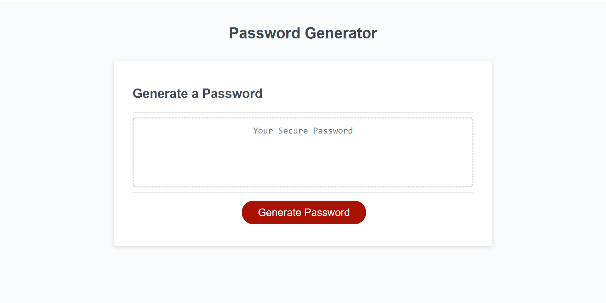
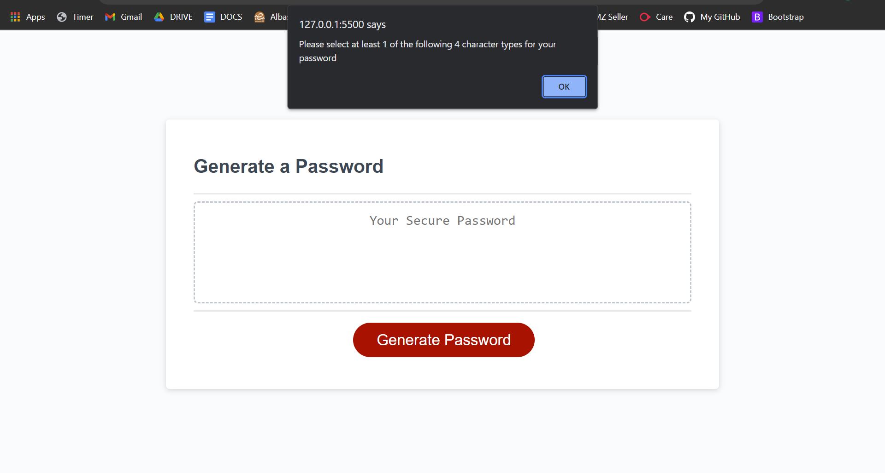
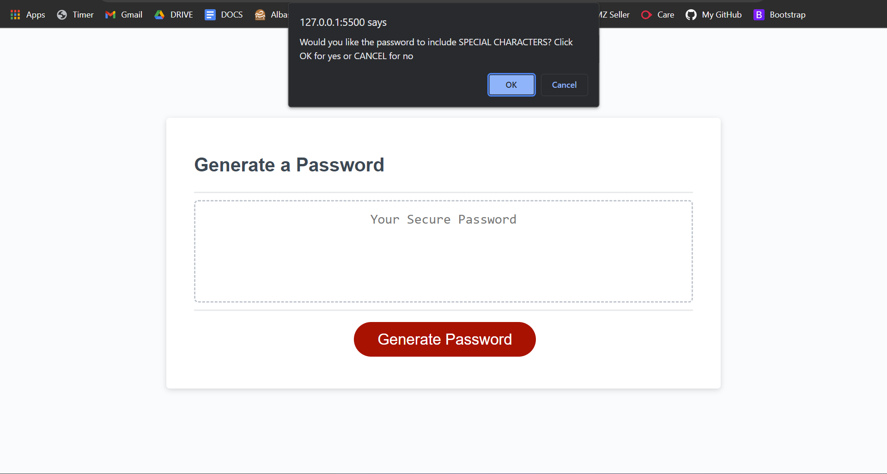
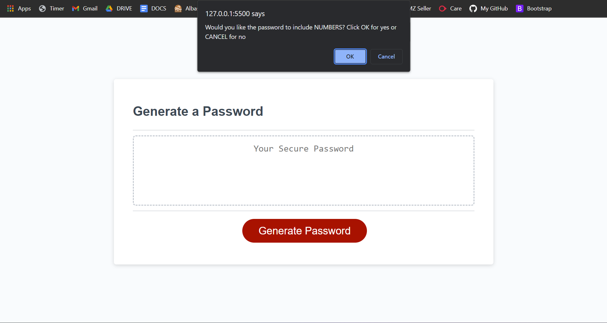
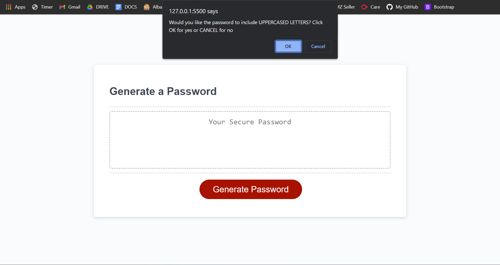
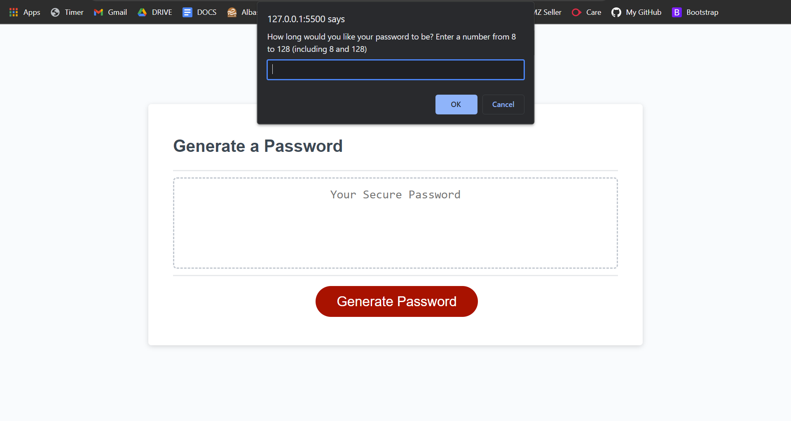
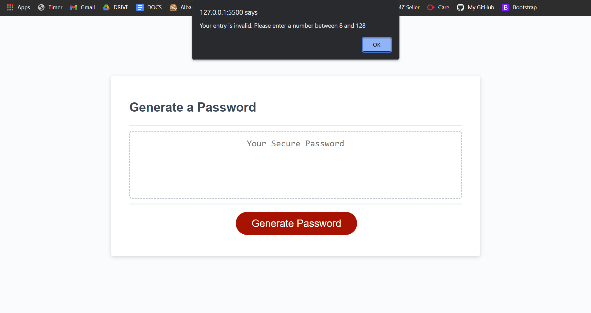
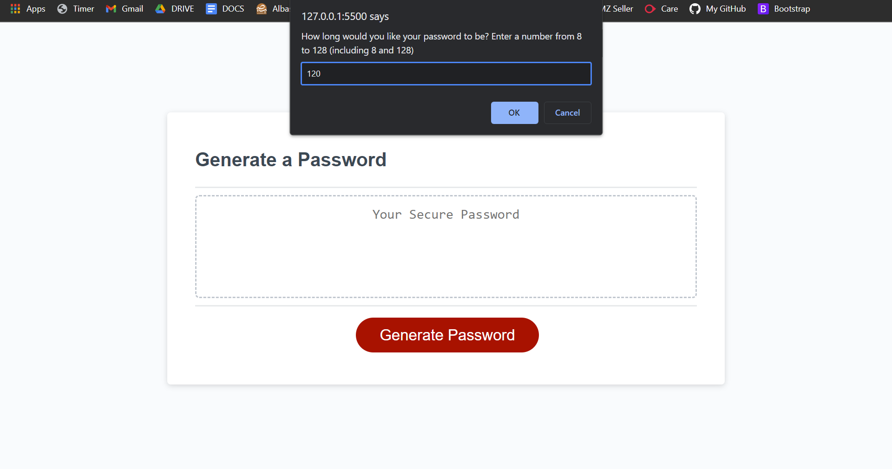
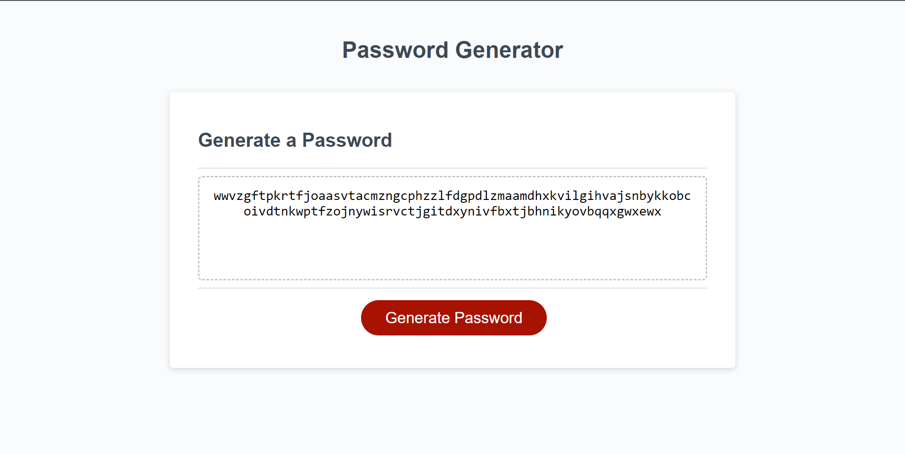

# Password Generator 

## Contents

- [About The project](#about-the-project)
- [How do I use the program?](#how-do-i-use-the-program)
- [How does it work?](#how-does-it-work)
- [How do I access the page?](#how-do-i-access-the-page)


## About The Project

The program generates a password upon the users request. 

The user is asked (via browser prompts) whether they'd like to include certain character types (e.g. special characters) in their password. They're then asked to enter their desired password length between 8 and 128 characters. 

Once they've answered these questions, their randomly generated password is printed to the webpage.


## How do I use the program?

The program uses alerts, prompts and confirms (built in browser pop-up messages) to inform the user, get information from them and ultimately generate a password that satisfies their requirements.

Below are a series of screenshots displaying the process of using the password generator webpage.

---
**Inital Webage screenshot**



This is what the webpage looks like before any user interaction.

---

**Screenshot 1 - First alert**



when the 'Generate Password' button is clicked, an alert appears instructing the user to select at least one of the following 4 character types for their password.

---

**Screenshots 2 - 5 - Character types**

These screenshots show a`confirm` pop up appearing in each screenshot, asking the user whether or not they'd like to include a character type in their password. 

**Screenshot 2**


\
**Screenshot 3**


\
**Screenshot 4**


\
**Screenshot 5**


---

**Screenshot 6 - No types selected**

If the user does not select any character types for their password, they are met with an alert telling them to try again. 

The process is ended and the user must click the 'generate password' button to start the process again.


---

**Screenshot 7 - Password Length**

Once the user has selected their desired character types, they are prompted input their desired password length. This must be between 8 and 128 characters (including 8 and 128).



---

**Screenshots 8 & 9 - Invalid Password length**

If the user enters an invalid length (not between 8 and 128 inclusive), they are alerted to enter a valid number. 

\
**Screenshot 8**


\
**Screenshot 9**


\
The previous prompt (asking the user to input password length) is then presented to them again.

---

**Screenshots 10 & 11 - Valid Password Length**

If a valid number is entered by the user, a randomly generated password matching their criteria is printed to the page

\
**Screenshot 10**


\
**Screenshot 11**


---

## How does it work?

The program utilises a series of functions to complete the various tasks required to generate a random password.

The program can be split into 6 sections as there are 5 functions and 1 event listener all with different purposes.


[Function 1: User Preferences](#function-1-user-preferences)
 [Function 2: Random Character Generation](#function-2-random-character-generation)
 [Function 3: Password Generation](#function-3-password-generation)
 [Function 4: Writing to the webpage](#function-4-writing-to-the-webpage)
 [Function 5: Clearing](#function-5-clearing)
 [Event Listener: All of the above](#event-listener-all-of-the-above)


There are initially 4 arrays of strings containing special characters, numbers, lowercase letters and uppercase letters respectively. 

These are the characters used to generate the user's password.

---

#### Function 1: User Preferences

The first function prompts the user to answer several questions and validates these answers to make sure they meet certain requirements. 

A few global variables are declared before the function (to make it easier to understand when reading the code).

<details>
<summary><b>Click to view code block</b></summary>

```
var selectedChars = [];

var charTypesArray = [specialCharacters, numericCharacters, lowerCasedCharacters, upperCasedCharacters];

var chartypesNames = ['Special Characters', 'Numbers', 'Lowercased Letters', 'Uppercased Letters'];

var numberOfTypesSelected = 0;

```

</details>

\
The array `selectedChars` will store the character types selected by the user.

The array `charTypesArray` stores the initial arrays of characters inside it.

The array `charTypesNames` stores the names of the character types, as strings, in the same order as the previous array so that they can be referenced together (this will become more clear).

`numberOfSelectedTypes` will store the number of character types the user selects.


<details>
<summary>Click here to view Code block</summary>


```

  function getPasswordOptions() {
  var validEntry = false; 

  alert('Please select at least 1 of the following 4 character types for your password');

 
  for(var j=0; j<charTypesArray.length; j++){
    
    
    var questionTypes = confirm('Would you like the password to include ' + chartypesNames[j].toUpperCase() + '? Click OK for yes or CANCEL for no');
    

    if(questionTypes === true){
      selectedChars = selectedChars.concat(charTypesArray[j]); 
      numberOfTypesSelected++;
    }
  }

  if(numberOfTypesSelected < 1){ 
    alert('You must select at least 1 character type. Please try again'); 
    return; 
  }

  numberOfTypesSelected = 0; 
  
  ...

  ```


</details>


\
First the variable `validEntry` is set to false. This will become important in the second part of the function.

Next the user is alerted to choose at least one of the following 4 character types

A for loop iterating until the iterator (j) is less than the length of the `charTypesArray` presents a  questions to the user with each iteration via a `confirm`. The (boolean) value returned from this prompt is stored in the variable `questionTypes`. 

After the user has answered, a conditional statement is executed, checking if user has chosen to include the current character type in their password (i.e `questionTypes === true`).

If this is the case, the array of the desired data type (`charTypesArray[j]`) is concatenated to the `selectedChars` array.

<small>

A brief explanation

In each iteration the question is represented using `charTypesNames[j]`. The actual data corresponding to a given iteration's question is stored in `charTypesArray[j]`

For example, If the user is asked about special characters, the string name, `'special characters` is stored in `charTypesNames[0]` whilst the special characters themselves are stored in `charTypesArray[0]`.
</small>

This conditional is followed by another one, checking if the number of character types selected is less than 1. If this is the case the function is terminated.


<details>
<summary>Click here to view code block</summary>


```
...


    var passwordLength = prompt('How long would you like your password to be? Enter a number from 8 to 128 (including 8 and 128)');

    var parsedPasswordLength = parseInt(passwordLength); 

  while(validEntry == false){
    
    var passwordLength = prompt('How long would you like your password to be? Enter a number from 8 to 128 (including 8 and 128)');

    var parsedPasswordLength = parseInt(passwordLength); 
8 
    if(parsedPasswordLength >= 8 && parsedPasswordLength <= 128 ){
      validEntry = true; //number meets criteria so loop is ended
    }

    else if(passwordLength === null){ 

      alert('No problem. Press the generate button when you would like a password'); 
    }
    else{
      alert('Your entry is invalid. Please enter a number between 8 and 128'); 
    }
    return parsedPasswordLength;
  }

}


```

</details>

\
The user is prompted to enter their desired password length. Their input is stored in the variable `passwordLength`.

since any user input returns a string, this must be converted into an integer. This is done by using `.parseInt()` method, passing `passwordLength` as a parameter. The result of this is stored in the variable `parsedPasswordLength`


A while loop is then executed while `validEntry` is false. This is to ensure that until the variable `validEntry` is true (a number between 8 and 128 inclusive has been entered) OR the user clicks cancel on the prompt (`passwordLength === null`), the loop is executed.

If the user provides an invalid entry, the loop is terminated.

the returned value from this function is `parsedPasswordLength` as this will be important to subsequent functions.

---


#### Function 2: Random Character Generation

Function 2, `getRandom(arr)` uses the length of an array (passed as a parameter) to get a the value stored in a random index. 

the random number is generated by using methods associated with the `Math` object, nameley `Math.floor` (to round down any value) and `Math.random` (to generate a random number).

`Math.random` results in a random number between 0 and 1. To get a random array index, this is multiplied by the arrays length. This is stored in the variable `randomIndex`

The returned value `arr.at(randomIndex)` uses the `.at()` method to pinpoint an array index. passing `randomIndex` means the index targeted is always random.


<details>

<summary>Click to view code block</summary>

```

function getRandom(arr) {
var randomIndex = Math.floor(Math.random() * arr.length);
  
return (arr.at(randomIndex)); 
}

```

</details>

---

#### Function 3: Password Generation

Function 3 combines the information gained so far to randomly generate the user's password

The `newPassword` array which is initially empty, stores the characters randomly selected for the password. This is done in the `generatePassword` function.

`newPasswordString`, initally declared without a value, stores the string created by concatenating the contents of the `newPassword` array

<details>
<summary>Click to view code block</summary>


```

var newPassword = []; 
var newPasswordString; 

function generatePassword() {

  var lengthOfPassword = getPasswordOptions();

 
  for(var i=0; i<lengthOfPassword; i++){  
    
    var currentChar = getRandom(selectedChars); 
    newPassword.push(currentChar); 

  }

  newPasswordString = newPassword.join(''); 

  return newPasswordString; 

}

```

</details>

\
The variable `lengthOfPassword` is assigned the return value of the `getPasswordOptions` function - the length of the password.

The subsequent for loop iterates for the length of the user's desired password.

With each iteration the variable `currentChar` is assigned the return value of the `getRandom` function - a random character from the `selectedChars` array (The array holding all the characters the user wanted to include in their password).

This random character is pushed to the `newPassword array`.

Once the loop has completed, the contents of the `newPassword` array are converted to a single string using the `.join()` method. This string is stored in the varuable `newPasswordString` which is the function's return value.

---

#### Function 4: Writing to the webpage

#### Function 5: Clearing

#### Event Listener: All of the above

## How do I access the page?
