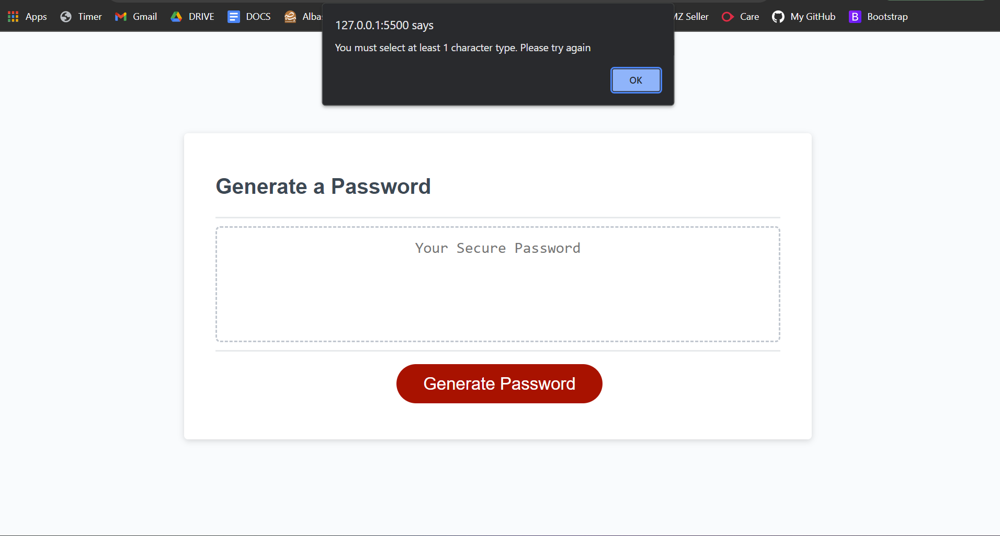

# Password Generator 

## Contents

- [About The project](#about-the-project)
- [How do I use the program?](#how-do-i-use-the-program)
- [How does it work?](#how-does-it-work)
- [How do I access the page?](#how-do-i-access-the-page)

## About The Project

The program generates a password upon the users request. 

The user is asked (via browser prompts) whether they'd like to include certain character types (e.g. special characters) in their password. They're then asked to enter their desired password length between 8 and 128 characters. 

Once they've answered these questions, their randomly generated password is printed to the webpage.

## How do I use the program?

The program uses alerts, prompts and confirms (built in browser pop-up messages) to inform the user, get information from them and ultimately generate a password that satisfies their requirements.

Below are a series of screenshots displaying the process of using the password generator webpage.

---
**Inital Webage screenshot**

This is what the webpage looks like before any user interaction.

---

**Screenshot 1 - First alert**

when the 'Generate Password' button is clicked, an alert appears instructing the user to select at least one of the following 4 character types for their password.

---

**Screenshots 2 - 5 - Character types**

These screenshots show a`confirm` pop up appearing in each screenshot, asking the user whether or not they'd like to include a character type in their password. 

**Screenshot 2**

\
**Screenshot 3**

\
**Screenshot 4**

\
**Screenshot 5**

---

**Screenshot 6 - No types selected**

If the user does not select any character types for their password, they are met with an alert telling them to try again. 

The process is ended and the user must click the 'generate password' button to start the process again.

---

**Screenshot 7 - Password Length**

Once the user has selected their desired character types, they are prompted input their desired password length. This must be between 8 and 128 characters (including 8 and 128).

---

**Screenshots 8 & 9 - Invalid Password length**

If the user enters an invalid length (not between 8 and 128 inclusive), they are alerted to enter a valid number. 

\
**Screenshot 8**

\
**Screenshot 9**

\
The previous prompt (asking the user to input password length) is then presented to them again.

---

**Screenshots 10 & 11 - Valid Password Length**

**Screenshot 10**

**Screenshot 11**

If a valid number is entered by the user, a randomly generated password matching their criteria is printed to the page

## How does it work?
## How do I access the page?

